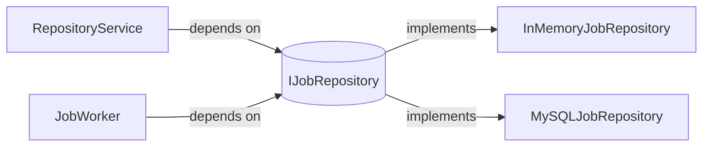
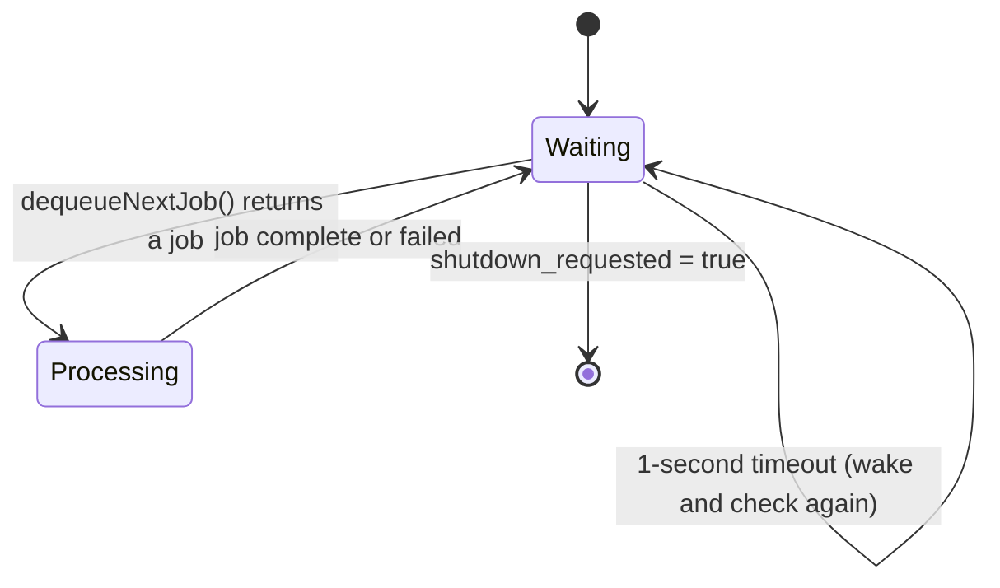

# Architecture

## Overview

Cortex follows **Clean Architecture** — a layered design where dependencies flow strictly inward. The HTTP layer knows about the service layer; the service layer knows about the repository interface; nothing in the inner layers knows about HTTP or databases.

```
┌─────────────────────────────────┐
│         HTTP Layer              │  Controllers, request parsing, response building
├─────────────────────────────────┤
│        Service Layer            │  Business logic, validation, orchestration
├─────────────────────────────────┤
│      Repository / Domain Layer  │  Storage interfaces, domain models
├─────────────────────────────────┤
│      Infrastructure Layer       │  Concrete storage (InMemory, MySQL)
└─────────────────────────────────┘
           ↑ Background Worker reads/writes across layers
```

---

## Layer Responsibilities

### HTTP Layer (`include/api/`, `include/analysis/`)

Controllers handle **only** HTTP concerns:
- Parse the incoming request
- Call the corresponding service method
- Map the result to a JSON response with the correct HTTP status code
- Never contain business logic

```cpp
void RepositoryController::submitRepository(req, callback) {
    auto request = RepositoryRequest::fromJson(req->getJsonObject());
    auto result = service_->submitRepository(request);  // delegate to service
    callback(RepositoryResponse(result).toHttpResponse());
}
```

### Service Layer (`include/api/*/...Service.h`)

Services contain **only** business logic:
- Validate inputs (via `UrlValidator`)
- Generate identifiers (via `UuidGenerator`)
- Coordinate between repository and worker
- Never know about HTTP status codes or JSON

### Repository Layer (`include/domain/IJobRepository.h`, `include/analysis/IAnalysisRepository.h`)

Pure abstract interfaces. Services depend on these interfaces, never on concrete implementations. This is the **Dependency Inversion Principle** in practice.

```cpp
class IJobRepository {
public:
    virtual void save(const Job&) noexcept = 0;
    virtual std::optional<Job> findById(const std::string& id) const noexcept = 0;
    virtual std::optional<Job> dequeueNextJob() noexcept = 0;
    virtual bool updateStatus(const std::string& id, JobStatus) noexcept = 0;
    // ...
};
```

### Domain Layer (`include/domain/`)

Plain C++ value objects with no dependencies:
- `Job` — represents a repository analysis job (id, url, status, timestamps)
- `AnalysisResult` — holds analysis output (fileCount, dirCount, totalLines, languageDistribution)
- `JobStatus` — enum: `QUEUED`, `RUNNING`, `COMPLETED`, `FAILED`

### Infrastructure Layer (`include/infrastructure/`)

Concrete repository implementations:
- `InMemoryJobRepository` — `std::unordered_map` protected by `std::mutex`; used when MySQL is unavailable
- `MySQLJobRepository` — prepared statements via MySQL Connector/C++; zero string concatenation in SQL

---

## Dependency Injection

All dependencies are injected via constructor. No singleton service objects; no global state in business logic.

`Application::buildDependencyGraph()` is the single place where the object graph is wired:

```cpp
// Application.cpp — full wiring in one place
jobRepository_      = std::make_shared<InMemoryJobRepository>();   // or MySQL
repositoryService_  = std::make_shared<RepositoryService>(jobRepository_, nullptr);
jobService_         = std::make_shared<JobService>(jobRepository_);
analysisRepository_ = std::make_shared<InMemoryAnalysisRepository>();
jobWorker_          = std::make_shared<JobWorker>(jobRepository_, analysisRepository_);
workerService_      = std::make_shared<WorkerService>(jobWorker_);
repositoryService_->setWorkerService(workerService_);   // two-stage wiring
analysisService_    = std::make_shared<AnalysisService>(analysisRepository_);
analysisController_ = std::make_shared<AnalysisController>(analysisService_);
```

**Why constructor injection?**
- Dependencies are explicit and visible
- No hidden state changes after construction
- Easy to test: swap any dependency for a mock by passing a different `shared_ptr`

---

## Repository Pattern

The `IJobRepository` interface is the contract between the service layer and storage. Swapping storage requires changing **only** the DI wiring — zero changes to `RepositoryService`, `JobService`, or `JobWorker`.



The application tries MySQL first on startup. If the connection fails, it silently falls back to `InMemoryJobRepository` with a warning log — no crash, no configuration required.

---

## Background Worker

The `JobWorker` runs on a dedicated `std::thread` throughout the application lifetime.



### Synchronization

```cpp
// Producer (HTTP thread) — RepositoryService
repository_->save(job);
workerService_->notifyJobAvailable();   // cv_.notify_one()

// Consumer (worker thread) — JobWorker::workerLoop()
work_cv_.wait_for(lock, 1s, [this] {
    return shutdown_requested_ || repository_->dequeueNextJob().has_value();
});
auto job = repository_->dequeueNextJob();
if (job) processJob(*job);
```

Key design choices:
- `std::atomic<bool> running_` and `shutdown_requested_` — lock-free flags
- `std::condition_variable` — efficient sleep with 1-second timeout fallback
- Worker thread joined gracefully on `stop()` — no detached threads

### Job Processing (`JobWorker::analyzeRepository`)

1. Create `/tmp/cortex-workspace/<jobId>/`
2. `git clone --depth 1 <url> <path>` via `popen()` (captures stderr)
3. If exit code != 0 → mark job `FAILED`, return
4. `std::filesystem::recursive_directory_iterator` over clone path (skips `.git/`)
5. For each regular file: count lines (`std::count` on `'\n'`), track extension
6. Store `AnalysisResult` in `IAnalysisRepository`
7. Update job status to `COMPLETED`

---

## Database Layer (`include/database/Database.h`)

`Database` is a **Meyers singleton** providing a single `sql::Connection`. It is:
- Initialized once during `Application::buildDependencyGraph()`
- Health-checked via `SELECT 1` after initialization
- Shut down gracefully in `Application::run()` after the HTTP server stops

`MySQLJobRepository` calls `Database::instance().getConnection()` per operation. All SQL uses `prepareStatement()` with positional `?` parameters — no string concatenation, no SQL injection surface.

---

## Logging

`Logger` is a singleton wrapping spdlog with two sinks:
- **Console** — colorized, human-readable
- **Rotating file** — `logs/cortex.log`, max 10 MB, 3 backups

Pattern: `[YYYY-MM-DD HH:MM:SS.mmm] [thread_id] [level] [file:line func] message`

All service and worker methods are `noexcept` and wrap their bodies in `try/catch`, logging errors via `Logger::instance().error(...)` without propagating exceptions.

---

## Configuration

`backend/config/config.json` is the single configuration file. `FileConfiguration` implements the `Configuration` abstract interface, which is injected into `Application`.

```json
{
  "server": { "host": "127.0.0.1", "port": 8080, "threads": 4 },
  "logging": { "level": "info", "file": "logs/cortex.log" }
}
```
